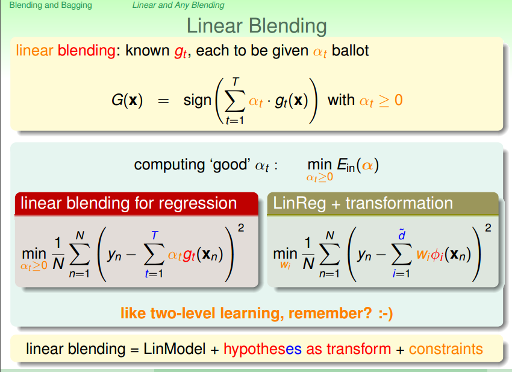

# Blending and Bagging

## 1. Aggregation的动机

### 1.1 一个aggregation的小故事

如果你有T个朋友，帮你预测股票的涨跌，他们有的说涨有的说跌，问题是你听了这些朋友的话，你应该怎么选择？

上告诉了我们几种基本的方法：

* 选择最信任的朋友，最信任的朋友可能是平时预测最准的。也就是我们之前学过了validation。
* 他们每一个人都很厉害，不如让他们每人一票来投票，我相信最后投票数最多的结果。
* 其实他们中的有些人相对其他人要强一点，所以可以给厉害的人多一些投票的数量，其他人少一些。
* 他们中的每个人的专长不一样，所以可以根据要投票的股票的种类来决定给每个人多少投票的数量。

那么我们上面的这个例子，把T个人的意见融合起来的想法就是我们的aggregation model做的事情，通过组合不同的hypothesis来达到更好的预测效果。

将我们的例子稍微数学化一点：

* 第一个方式其实就是validation，选取一个在验证集表现最好的hypothesis。
* 以uniform的方式融合所有的hypothesis。
* 以non-uniform的方式融合所有的hypothesis。当然也包含了选择一个人的情形和每人一票的情形。
* 以conditionlly combine的方式融合所有hypothesis。当然包含了所有上面的情形。

aggregation是一个非常庞大的家族，有各式各样的方法，每个方法的面向都不一样。

### 1.2 validation在这个时候会做得不好

上面包含了一个思想是我们已经有了一些还不错的模型，然后我们通过validation来选择一个最强的。所以validation很依赖一些比较好的g-，如果这些小的g-都很弱的话那选出来将是没有意义的。

从上面可知，validation面对一堆弱的hypothesis会显得无能为力。那我们的aggregation能做到讲一堆弱者融合起来变强么？

### 1.3 为什么aggregation可能会做的更好

如上左图所示，如果我们只能用垂直的线或者水平的线的话，那做得效果会不然好，如果让所有的直线和垂线做投票的话，那看起来我们可以得到一个strong的G(x)。好像是扩展了我们的hypothesis，达到了feature transform的效果。

如上右图所示，如果我有一堆hypothesis，他们做得都还不差的话，你要选哪一条？我们在SVM中说过，我们要选边界最宽的哪一条。但是如果是PLA可能就会选中间的任意一条（灰色的线），如果我让所有的灰色的线来做投票的话，会得到类似图中黑色的比较中庸的线，所以投票是由好处的。也就是具有类似large margin的regularization的效果。

我们之前说过的feature transforM和regularization几乎是对立面的事情，二者不可兼得。那现在看来，只要做好aggregation，就有可能实现两全其美。

## 2. Uniform Blending

之前我们介绍了aggregation的概念，也就是融合hypothesis的概念，那具体有什么方法来融合呢？现在就开始介绍第一个融合的方法blending（中文混合的意思）。

blending的使用有一个前提条件就是我们已经知道的要用于融合的gt，不管你是通过感知机还是decision stump等等得出的gt。

根据blending使用细节，我们还可以将blending细分为三种：

* uniform blending（一人一票）
* linear blending（一人可能多票可能无票）
* any blending（按情况给票）

从上面可以看出，三种blending的方法其实是按照我们之前介绍过的方法来区分的，我们本小节首先介绍uniform blending。

### 2.1 uniform blending for classification

很容易理解，看看每个hypothesis的预测结果，每个hypothesis的结果给1票，最后哪一类的得票多就选哪一类。

上面要说明的一个思想就是：当我们的gt不同的时候，才会让我们的aggregation产生效果，能使多数纠正少数。

### 2.2 uniform blending for regression

如果用于aggregation的话，一个自然的想法就是将所有人的预测结果都加起来做一个平均来作为最终的结果。

上面也说明了一个思想就是：如果每一个小gt都相同的话，那aggregation是没有用的。如果我们的gt有差异性，那我们可以利用这个差异性来达到一种互补的效果。

不管是对于classification还是regression，要想让uniform blending有效，必须让我们的gt产生diversity。

### 2.3 uniform blending的理论分析

下面我们会来对uniform blending做一个简单的理论分析，该分析是关于一个gt(注意是一个！)，gt(x)-f(x)的平方误差，和我们最后得到的G，G-f的平方误差的关系，来说明一些问题

从上面的推导可以看出，我们任意的一个gt的平方误差总是大于最后的aggregation的G的平方误差的，说明做uniform blending是有好处的，应该会比随便选一个gt好。

### 2.4 演算法的期望

根据上一节的推导，我们假设有一个演算法A，根据D（大小均为N，均服从某一个P的分布）来产生一个gt,假设算法运行无穷多次，会产生一个期望的g。我们可以得到如下结论：

* 一个演算法A的期望表现 = 共识的表现（Eout(g)） +
* 一个演算法A的期望表现 = bias（偏差，我的共识和最想要的f差多远）+ variance（我的小gt的意见到底有多不一样）

我们可以想象平均的过程就是减小方差的过程，那我算法的表现有可能会变好。

## 3. Linear Blending and Any Blending

我们在第二节中讲解了uniform blending，其采用一人一票的机制，来达到aggregation的效果。现在我们要求每人不同的票来更好的效果。那么现在我们不仅仅是将gt合起来，我们还要考虑怎样合起来，用什么样的at合起来。

那什么样的at才是最好的呢？一个最自然的想法是能让我的Ein最小的at是最好的。我们可以将gt当做transform将at当做未知参数的话，就可以通过解决linear model（注意这个linear model，如果是regression就用squared error，如果是logistics regression就要用cross entropy的错误衡量方式）的方式来求解最优的at了。

上面告诉我们at的限制是不需要的。

### 3.1 linear blending vs selection

现实中，gt是根据不同的model通过minimize Ein 来求得的，我们之前说过，如果用Ein来训练又用Ein来选择，我们选择一个best of best的model，这样我们要付出的模型复杂度的代价就是所有的大H的模型复杂度的总和。

我们之前说过linear blending包含了selection，表示如果用Ein来做linear blending的话（主要是指选择at的过程），那就是aggregation of best，那复杂度代价就会比best of best更大，所以实际上不建议用Ein来再学习at，因为这样很容易就会overfitting。

我们在实际使用中应该用Dval来选择at，然后训练gt的时候用的是Dtrain。

### 3.2 any blending

所以如上图，我们一般做linear blending的时候，从Dtrain中得到一堆g-，通过这些g-将我的Dval中的x空间的资料转换到Z空间的资料，然后再使用一个linear model（注意这个linear model，如果是regression就用squared error，如果是logistics regression就要用cross entropy的错误衡量方式）用在Z空间的资料上，求出a。然后回传的G由a和φ(x)的内积和一个linear hypothesis（如果是linear regression，那什么也不用做，如果是linear classification，那需要加一个sign，如果是logistics regression，那么就要加一个logistics函数）组成，注意最后回传的是φ而不是φ-，意味着我们是gt而不是gt-，所以就是说还要将我们的model在整体的D上学习出g，然后再返回给G。

所以我们也可以不一定要用linear model，我们一般叫any blending，又一个名词叫做stacking。其实和linear blending的区别不大。在做完X空间到Z空间的转换后，我们不是用linear model，可以用我们任何想的到的model。

## 4. Bagging

### 4.1 learning

之前的blending的假设是我们已经有了不同的g，然后考虑怎么结合起来。现在我们考虑一个问题，那我们可不可以通过边学习g边决定怎样对g进行组合，相对于blending，我们把这样的aggregation方式叫做learning。我们之前已经知道，blending可以按照不同的投票方式划分为3中不同的blending的模型，同样地，我们的learning也可以按照不同的投票方式划分3中不同模型：

* bagging（一人一票）
* Adaboost（一人可能多票可能无票）
* Decision Tree（按情况给票）

本章节我们先来学习bagging。

### 4.2 diversity

我们在blending的时候说过，gt的差异性（diversity）很重要，之前我们blending不用去考虑gt怎么来的。但是现在我们需要考虑，有差异性的gt的来源主要有以下几种路径：

接下来我们讨论如何通过同一份的数据来产生差异性的gt。

我们之前已经说过，一个演算法的表现可以拆开成bias和variance，他给我们的结论是：大家的共识比单一的gt来的好，但是我们推导这个结论的时候是使用的同一分布的不同的D，可是我们现在只有一堆确定的资料，那要怎么做呢？这是一个问题。

还有我们的推导过程用了无数多个g，这个我们也做不到。

所以我们只能做一点妥协：

* 使用大的T（也代表g的数量）
* 想办法从现有数据生成很多不一样的且符合原始数据分布的data。

在统计学上有一个工具叫做bootstrapping，能够从有限的资料里面模拟不一样的资料。方法也很简单，就是在我现有的D里面随机地有放回地取N（大小随意）笔资料作为我们的新的Dt。

### 4.3 bootstrap aggregation

所以我们的新的aggregation的大致流程如上图所示，这就是我们的boostrap aggregation，也叫做bagging，他可以基于任何的base algorithm A，所以我们把这种构建在其他演算法上的演算法叫做meta algorithm。

